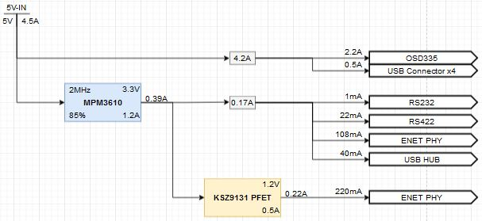
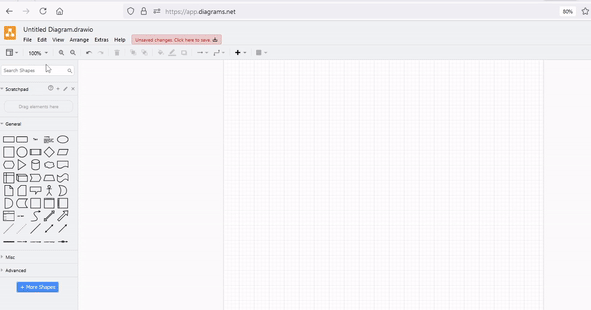
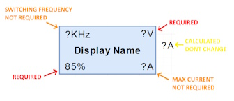
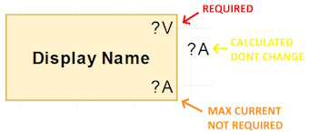
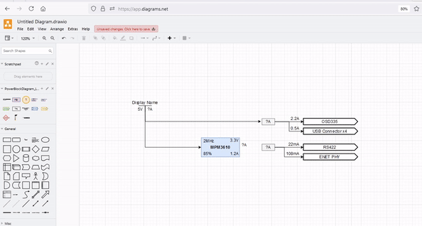

# Power Block Diagram Current Calculator

1. Create a power block diagram using the custom `DrawIO\Library\...Library.xml` library & define all downstream loads.


2. Calculate all upstream current rails using `python calculate_currents.py`. It exports new draw.io that replaces ? with rail current.


## Import Custom Library from Draw.IO

Importing the custom drawio library:
- `File, Open Library From, Device...`
- Browse to `DrawIO\Library\...Library.xml` file
- Library will appear in the left tool bar in drawio



## Create Power Block Diagram
- Drag in SW Regulators, LDOs, current sums, loads, etc.
- For switching regulators & LDOs, ?V is req
- Connect them all with lines. This step is critical, if there are unconnected rails the script will throw an error trying to point you to the problem. Make sure the lines connect to the green dots that appear when you hover over the object edges.
- Loads can multiply if a multiplier is added to the end of a load name. For example `LEDs x8`. So if you made the load current 5mA it would be 40mA when running the calculation.






## Requirements

- Python 3.x
- The following Python libraries:
  - `xml.etree.ElementTree`
  - `tkinter` For the file dialog.
  - `pandas`
  - `numpy`
  - `os`
  - `re`

Install required packages with:

```bash
pip install pandas numpy
```

## How It Works

1. **File Selection**:
   - If only one `.xml` file is present in the directory, it is automatically selected.
   - Otherwise, a file dialog is used to select the XML export file from the draw.io diagram.

2. **Parsing the XML**:
   - The script parses the XML to extract important attributes (ID, type, labels, parent-child relationships, etc.) into a `pandas` DataFrame.

3. **Flattening and Cleaning Data**:
   - The script removes HTML tags from attributes and converts relevant columns (such as currents, voltages, and efficiencies) into numerical values.

4. **Recursive Calculations**:
   - For each node (component) in the power system, the script recursively calculates missing load currents by analyzing downstream currents and efficiency values.
   - For nodes like AC/DC converters, the output voltage is calculated from the input AC voltage, considering a full bridge rectifier.

5. **XML Update**:
   - Once the currents and voltages are calculated, the script updates the original XML with these values.
   - The updated XML is saved to a new file.

## Running the Script

1. Place your draw.io XML export file in the same directory as the script.
2. Run the script:

```bash
python calculate_currents.py
```

3. If more than one XML file is present, you will be prompted to select one via a file dialog.
4. The script will process the file, perform current back-calculations, and generate a new XML file with updated current and voltage values.

## Output

The script generates a new XML file with the suffix `_with_currents.xml` that includes updated labels with the calculated values. This file can be imported back into draw.io for visualization.

## License

This project is licensed under the MIT License - see the [LICENSE](LICENSE) file for details.

### MIT License

Permission is hereby granted, free of charge, to any person obtaining a copy of this software and associated documentation files (the "Software"), to deal in the Software without restriction, including without limitation the rights to use, copy, modify, merge, publish, distribute, sublicense, and/or sell copies of the Software, and to permit persons to whom the Software is furnished to do so, subject to the following conditions:

The above copyright notice and this permission notice shall be included in all copies or substantial portions of the Software.

THE SOFTWARE IS PROVIDED "AS IS", WITHOUT WARRANTY OF ANY KIND, EXPRESS OR IMPLIED, INCLUDING BUT NOT LIMITED TO THE WARRANTIES OF MERCHANTABILITY, FITNESS FOR A PARTICULAR PURPOSE AND NONINFRINGEMENT. IN NO EVENT SHALL THE AUTHORS OR COPYRIGHT HOLDERS BE LIABLE FOR ANY CLAIM, DAMAGES OR OTHER LIABILITY, WHETHER IN AN ACTION OF CONTRACT, TORT OR OTHERWISE, ARISING FROM, OUT OF OR IN CONNECTION WITH THE SOFTWARE OR THE USE OR OTHER DEALINGS IN THE SOFTWARE.
