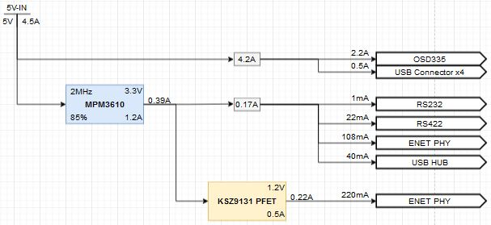
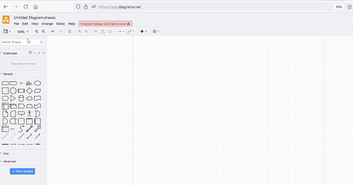
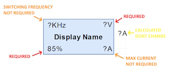
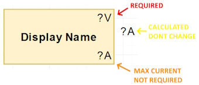

# Power Block Diagram Current Calculator

Automatically back-calculate upstream currents in power block diagrams built with [draw.io](https://app.diagrams.net). Currents update in real-time as you build the diagram — no export/import cycle needed.



## Quick Start

1. Open [app.diagrams.net](https://app.diagrams.net)
2. Import the custom library: `File > Open Library From > Device...` and select `DrawIO/Library/DrawIO_PowerBlockDiagram_Library.xml`
3. Load the plugin using one of the methods below
4. Build your power tree — upstream currents calculate automatically

## Loading the Plugin

### Option 1: Bookmarklet (Web)

1. Open `DrawIO/Plugin/install_bookmarklet.html` in your browser
2. Drag the blue button to your bookmarks bar
3. Open draw.io, then click the bookmark to load the plugin
4. You'll see a confirmation alert. Re-click each time you reload draw.io.

### Option 2: Desktop App

1. Launch draw.io with: `"C:\Program Files\draw.io\draw.io.exe" --enable-plugins`
2. Go to **Extras > Plugins...**
3. Click **Add** and select `DrawIO/Plugin/power_block_calculator.js`
4. Click **Apply** and restart (with `--enable-plugins`)

### Option 3: Python Script (Legacy)

The original `calculate_currents.py` script is still available. Export your diagram as XML, run `python calculate_currents.py`, and import the generated `_with_currents.xml` back into draw.io.

## Building a Diagram

1. Drag components from the library: SW Regulators, LDOs, AC/DC, Sources, Loads, Filters, Current Sums, Power Switches
2. Double-click to edit values (voltage, current, efficiency)
3. Connect components with lines — make sure they snap to the green connection points
4. The plugin automatically calculates all upstream currents



### Component Properties

| Component | User Enters | Plugin Calculates |
|-----------|------------|-------------------|
| **Source** | Output voltage | Total load current |
| **SW Reg** | Output voltage, efficiency | Input current (accounting for conversion) |
| **LDO** | Output voltage | Input current (passthrough) |
| **AC/DC** | Efficiency | Output voltage, input current |
| **Load** | Name, current | — |
| **Filter / Power Switch** | — | Current (passthrough) |
| **Current Sum (isum)** | — | Sum of downstream currents |

### Load Multipliers

Append `x<N>` to a load name to multiply its current. For example, `LEDs x8` with 5mA becomes 40mA.




## Mutually Exclusive Loads (XOR)

Add XOR tags to load names to indicate loads that never run simultaneously. The plugin uses the higher current instead of summing both.

### Paired XOR: `XOR1A` / `XOR1B`

Two specific loads that alternate. Only the larger of the pair counts at their common ancestor.

```
X-COIL XOR1A    (0.37A)  ─── on +12V branch
X-COIL XOR1B    (0.37A)  ─── on -12V branch
→ At the 28V source: only one 0.37A contribution (reflected), not both
```

Multiple groups work independently: `XOR1A`/`XOR1B` is one pair, `XOR2A`/`XOR2B` is another.

### Rail-Exclusive XOR: `XOR3` (number, no letter)

This load is mutually exclusive with **all other loads on the same rail**. The parent node uses `max(this load, sum of all other loads)`.

```
SBPU Heater XOR3    (2A)   ─── on 12V isum
OpAmp x4            (40mA) ─── on 12V isum
ADC                 (20mA) ─── on 12V isum
→ isum current = max(2A, 0.04 + 0.02) = 2A
```

### Global-Exclusive XOR: `XOR` (bare, no number)

This load is mutually exclusive with **all other loads in the entire diagram**. Propagates through voltage converters and resolves at every level as `max(this load, everything else)`.

```
Launch Lock XOR     (3A)   ─── only fires when nothing else is active
→ Source current = max(3A reflected, sum of all other loads reflected)
```

## How It Works

The plugin hooks into draw.io's mxGraph API and recalculates on every diagram change:

1. **Top-down voltage propagation** — passthrough components inherit their parent's voltage; AC/DC computes output from input AC
2. **Bottom-up current summation** — leaf load currents sum upward; switching regulators and AC/DC converters account for voltage conversion and efficiency: `I_in = (I_out × V_out) / (η × V_in)`
3. **XOR resolution** — paired XOR groups take max instead of sum at merge points; rail-exclusive compares against siblings; global-exclusive compares against the entire tree

## License

This project is licensed under the MIT License - see the [LICENSE](LICENSE) file for details.
